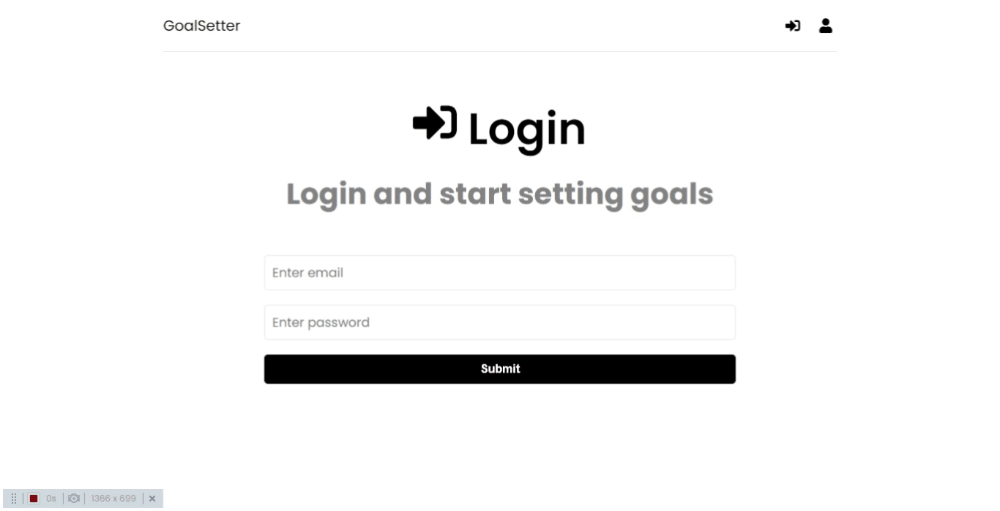
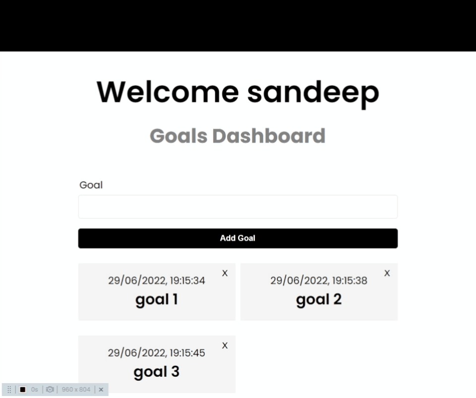

# GoalSetterApp

## Link : **[LIVE](https://merntaskm.herokuapp.com/register)**

### About the Project
* It is a simple TODO list app.

* If the user is not registered, user need to create account 

* If account already exist user can login directly

* User can add goals they want, goals cards will have details(Date and time it created at and the goal)

* User can delete the goal by clicking X button

### Features
* For the backend part, expressjs, mongooose, mongoDB(Database), JWT are used
* For secure authentication JWT is used.
* For frontend part Reactjs is used and Redux is used for state management.

### Built With
* [Reactjs](https://reactjs.org/)
* [Nodejs](https://nodejs.org/en/)
* [MongoDB](https://www.mongodb.com)
